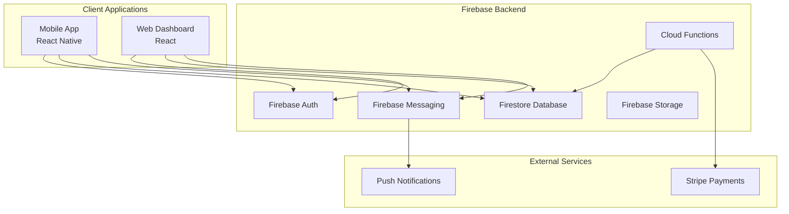

# Design Document: Beacon Core Platform

## Overview

Beacon is a mobile-first volunteer operations platform built on Firebase for rapid deployment and minimal infrastructure complexity. The system consists of a React Native mobile app for volunteers and a React web dashboard for coordinators, both sharing a common Firebase backend with real-time synchronization.

The architecture prioritizes simplicity and speed-to-market by leveraging Firebase's managed services for authentication, real-time database, cloud functions, and hosting. This approach eliminates the need for custom backend infrastructure while providing the scalability and reliability required for volunteer event management.

## Architecture

### High-Level Architecture



### Technology Stack

**Frontend:**

- **Mobile App**: React Native with Expo for cross-platform development
- **Web Dashboard**: React with TypeScript for type safety
- **State Management**: React Query for server state, Zustand for client state
- **UI Components**: Native Base (mobile) and Chakra UI (web) for consistent design

**Backend:**

- **Database**: Firestore for real-time data synchronization
- **Authentication**: Firebase Auth with email/password and social providers
- **Functions**: Firebase Cloud Functions for business logic and integrations
- **File Storage**: Firebase Storage for incident photos and documents
- **Messaging**: Firebase Cloud Messaging for push notifications

**External Integrations:**

- **Payments**: Stripe for secure payment processing
- **Maps**: Google Maps API for location services

## Components and Interfaces

### Core Data Models

**User Model:**

```typescript
interface User {
  uid: string;
  email: string;
  displayName: string;
  role: "volunteer" | "coordinator" | "collaborator" | "owner";
  organizationId?: string;
  profile: {
    phone?: string;
    emergencyContact?: string;
    skills: string[];
    availability: string[];
  };
  createdAt: Timestamp;
  lastActive: Timestamp;
}
```

**Event Model:**

```typescript
interface Event {
  id: string;
  organizationId: string;
  title: string;
  description: string;
  location: {
    address: string;
    coordinates: GeoPoint;
  };
  dateRange: {
    start: Timestamp;
    end: Timestamp;
  };
  shifts: Shift[];
  coordinators: string[]; // User UIDs
  collaborators: string[]; // User UIDs
  status: "draft" | "published" | "active" | "completed" | "cancelled";
  pricing: {
    basePrice: number;
    volunteerTiers: { count: number; price: number }[];
  };
  createdAt: Timestamp;
  updatedAt: Timestamp;
}
```

**Shift Model:**

```typescript
interface Shift {
  id: string;
  eventId: string;
  title: string;
  description: string;
  timeSlot: {
    start: Timestamp;
    end: Timestamp;
  };
  requiredVolunteers: number;
  assignedVolunteers: string[]; // User UIDs
  roles: {
    title: string;
    description: string;
    count: number;
    assignedTo: string[]; // User UIDs
  }[];
  status: "open" | "full" | "active" | "completed";
}
```

**Attendance Model:**

```typescript
interface AttendanceRecord {
  id: string;
  eventId: string;
  shiftId: string;
  volunteerId: string;
  checkIn: {
    timestamp: Timestamp;
    location?: GeoPoint;
    method: "manual" | "qr" | "geofence";
  };
  checkOut?: {
    timestamp: Timestamp;
    location?: GeoPoint;
    method: "manual" | "qr" | "geofence";
  };
  status: "checked-in" | "checked-out" | "no-show";
}
```

**Incident Model:**

```typescript
interface Incident {
  id: string;
  eventId: string;
  shiftId?: string;
  reporterId: string;
  title: string;
  description: string;
  severity: "low" | "medium" | "high" | "critical";
  category: "safety" | "equipment" | "volunteer" | "other";
  location?: GeoPoint;
  photos?: string[]; // Storage URLs
  status: "open" | "investigating" | "resolved" | "closed";
  assignedTo?: string; // Coordinator UID
  resolution?: string;
  createdAt: Timestamp;
  updatedAt: Timestamp;
}
```

### Firebase Security Rules

**Firestore Security Rules:**

```javascript
rules_version = '2';
service cloud.firestore {
  match /databases/{database}/documents {
    // Users can read/write their own profile
    match /users/{userId} {
      allow read, write: if request.auth != null && request.auth.uid == userId;
    }

    // Event access based on role
    match /events/{eventId} {
      allow read: if request.auth != null && (
        resource.data.coordinators.hasAny([request.auth.uid]) ||
        resource.data.collaborators.hasAny([request.auth.uid]) ||
        resource.data.status == 'published'
      );
      allow write: if request.auth != null &&
        resource.data.coordinators.hasAny([request.auth.uid]);
    }

    // Attendance records
    match /attendance/{recordId} {
      allow read, write: if request.auth != null && (
        resource.data.volunteerId == request.auth.uid ||
        isEventCoordinator(resource.data.eventId)
      );
    }

    // Incident reports
    match /incidents/{incidentId} {
      allow read: if request.auth != null && (
        resource.data.reporterId == request.auth.uid ||
        isEventCoordinator(resource.data.eventId)
      );
      allow create: if request.auth != null;
      allow update: if request.auth != null &&
        isEventCoordinator(resource.data.eventId);
    }

    function isEventCoordinator(eventId) {
      return get(/databases/$(database)/documents/events/$(eventId))
        .data.coordinators.hasAny([request.auth.uid]);
    }
  }
}
```

### Cloud Functions

**Key Cloud Functions:**

1. **Event Management Functions**
   - `createEvent`: Validates event data and initializes pricing
   - `updateEvent`: Handles event modifications and notifications
   - `publishEvent`: Makes events visible to volunteers

2. **Attendance Functions**
   - `processCheckIn`: Records attendance and validates location
   - `processCheckOut`: Calculates shift duration and updates records
   - `generateAttendanceReport`: Creates attendance summaries

3. **Notification Functions**
   - `sendEventNotifications`: Notifies volunteers of event changes
   - `sendIncidentAlerts`: Alerts coordinators of new incidents
   - `sendShiftReminders`: Reminds volunteers of upcoming shifts

4. **Payment Functions**
   - `calculateEventPricing`: Determines event costs based on volunteer count
   - `processPayment`: Handles Stripe payment processing
   - `updatePaymentStatus`: Updates event status after payment

### API Interfaces

**Mobile App API Layer:**

```typescript
// Event Service
class EventService {
  async getAvailableEvents(): Promise<Event[]>;
  async joinShift(eventId: string, shiftId: string): Promise<void>;
  async leaveShift(eventId: string, shiftId: string): Promise<void>;
  async getMyShifts(): Promise<Shift[]>;
}

// Attendance Service
class AttendanceService {
  async checkIn(shiftId: string, location?: GeoPoint): Promise<void>;
  async checkOut(shiftId: string): Promise<void>;
  async getAttendanceHistory(): Promise<AttendanceRecord[]>;
}

// Incident Service
class IncidentService {
  async reportIncident(incident: Partial<Incident>): Promise<string>;
  async uploadIncidentPhoto(incidentId: string, photo: File): Promise<string>;
}
```

**Web Dashboard API Layer:**

```typescript
// Event Management Service
class EventManagementService {
  async createEvent(event: Partial<Event>): Promise<string>;
  async updateEvent(eventId: string, updates: Partial<Event>): Promise<void>;
  async getEventAttendance(eventId: string): Promise<AttendanceRecord[]>;
  async inviteCollaborator(eventId: string, email: string): Promise<void>;
}

// Incident Management Service
class IncidentManagementService {
  async getEventIncidents(eventId: string): Promise<Incident[]>;
  async updateIncidentStatus(incidentId: string, status: string): Promise<void>;
  async assignIncident(
    incidentId: string,
    coordinatorId: string,
  ): Promise<void>;
}
```

## Data Models

### Firestore Collections Structure

```
/users/{userId}
/organizations/{orgId}
/events/{eventId}
  /shifts/{shiftId}
  /attendance/{recordId}
  /incidents/{incidentId}
/notifications/{notificationId}
/payments/{paymentId}
```

### Real-Time Data Flow

**Event Updates:**

1. Coordinator modifies event in web dashboard
2. Cloud Function validates changes and updates Firestore
3. Firestore triggers real-time listeners in mobile apps
4. Mobile apps update UI with new event information
5. Push notifications sent for critical changes

**Attendance Tracking:**

1. Volunteer checks in via mobile app
2. App validates location and creates attendance record
3. Real-time listener updates coordinator dashboard
4. Dashboard shows live attendance status
5. Automated alerts for no-shows or staffing issues

**Incident Reporting:**

1. Volunteer reports incident via mobile app
2. Incident record created with photos uploaded to Storage
3. Cloud Function sends immediate alerts to coordinators
4. Coordinators receive push notification and dashboard update
5. Incident management workflow begins

## Correctness Properties

_A property is a characteristic or behavior that should hold true across all valid executions of a system—essentially, a formal statement about what the system should do. Properties serve as the bridge between human-readable specifications and machine-verifiable correctness guarantees._

Based on the prework analysis and property reflection, the following properties capture the essential correctness requirements for the Beacon platform:

### Property 1: User Authentication and Authorization

_For any_ user registration or login attempt, the system should create accounts with proper default permissions, authenticate valid credentials successfully, and deny unauthorized access to protected features while maintaining security boundaries.
**Validates: Requirements 1.1, 1.2, 1.3, 1.4, 1.5**

### Property 2: Event Creation and Management

_For any_ event creation or modification by authorized coordinators, the system should store all required event details persistently, allow proper shift configuration, propagate updates to all related systems, and notify affected volunteers.
**Validates: Requirements 2.1, 2.2, 2.3, 2.4**

### Property 3: Volunteer Shift Operations

_For any_ volunteer shift interaction (joining, leaving, viewing), the system should maintain accurate availability counts, record commitments properly, and display complete shift information with timing and location details.
**Validates: Requirements 3.1, 3.2, 3.3, 3.4, 3.5**

### Property 4: Attendance Tracking Round-Trip

_For any_ volunteer check-in followed by check-out, the system should create complete attendance records with timestamps and location data, calculate accurate participation duration, and maintain data integrity throughout the process.
**Validates: Requirements 4.1, 4.2**

### Property 5: Real-Time Attendance Monitoring

_For any_ attendance status change, the system should update live dashboards within the specified time limits, trigger appropriate alerts for staffing issues, and maintain functionality during network connectivity problems.
**Validates: Requirements 4.3, 4.4, 4.5**

### Property 6: Incident Reporting and Management

_For any_ incident report submission, the system should create complete incident records with all required metadata, notify relevant coordinators immediately, maintain full audit trails of status changes, and provide comprehensive management capabilities.
**Validates: Requirements 5.2, 5.3, 5.4, 5.5**

### Property 7: Cross-Platform Data Synchronization

_For any_ data modification on any platform component, the system should propagate changes to all connected clients within performance requirements, maintain consistency across platforms, handle concurrent modifications gracefully, and provide appropriate sync status indicators.
**Validates: Requirements 6.1, 6.2, 6.3, 6.4, 6.5**

### Property 8: Payment Processing and Pricing

_For any_ payment-related operation, the system should calculate pricing accurately based on event parameters, process transactions securely with proper confirmation, handle payment failures appropriately, and generate accurate invoices with detailed usage information.
**Validates: Requirements 7.1, 7.2, 7.3, 7.4, 7.5**

### Property 9: Mobile App Offline Functionality

_For any_ mobile app operation during limited connectivity, the system should cache critical data locally, enable core functionality offline, and synchronize all changes when connectivity is restored without data loss.
**Validates: Requirements 9.4**

### Property 10: Notification Delivery and Preferences

_For any_ notification trigger event, the system should send appropriate notifications to relevant users, respect user preferences and privacy settings, track delivery status, and provide fallback communication methods when needed.
**Validates: Requirements 10.1, 10.2, 10.3, 10.4, 10.5**

### Property 11: Incident Reporting Time Performance

_For any_ incident reporting attempt from the mobile app, the system should enable complete submission within 30 seconds from app launch, ensuring rapid response capabilities during critical situations.
**Validates: Requirements 9.2**

## Error Handling

### Firebase Error Handling Strategy

**Authentication Errors:**

- Invalid credentials: Display user-friendly error messages and provide password reset options
- Network timeouts: Implement retry logic with exponential backoff
- Account lockouts: Provide clear guidance for account recovery

**Database Operation Errors:**

- Write conflicts: Implement optimistic locking with conflict resolution UI
- Permission denied: Log security violations and display appropriate error messages
- Quota exceeded: Implement graceful degradation and admin notifications

**Real-Time Sync Errors:**

- Connection drops: Maintain local state and queue operations for retry
- Sync conflicts: Use last-write-wins with user notification for important conflicts
- Listener failures: Implement automatic reconnection with exponential backoff

**Payment Processing Errors:**

- Card declined: Provide clear error messages and alternative payment options
- Network failures: Implement retry logic and maintain payment state
- Webhook failures: Use idempotent processing and manual reconciliation tools

### Offline Error Handling

**Mobile App Offline Mode:**

- Cache critical data using AsyncStorage/SecureStore
- Queue write operations for later synchronization
- Provide clear offline indicators and sync status
- Handle conflicts when reconnecting with user-friendly resolution

**Data Validation:**

- Client-side validation for immediate feedback
- Server-side validation for security and consistency
- Graceful handling of validation failures with specific error messages

## Testing Strategy

### Dual Testing Approach

The Beacon platform will use both unit testing and property-based testing to ensure comprehensive coverage:

**Unit Tests:**

- Focus on specific examples, edge cases, and error conditions
- Test integration points between Firebase services
- Validate UI components and user interactions
- Cover authentication flows and permission checks
- Test offline functionality and sync scenarios

**Property-Based Tests:**

- Verify universal properties across all inputs using comprehensive randomization
- Test data consistency and integrity under various conditions
- Validate business logic with generated test data
- Ensure security properties hold across different user roles and scenarios
- Test real-time synchronization with concurrent operations

### Property-Based Testing Configuration

**Testing Framework:**

- **Mobile (React Native):** fast-check for JavaScript property-based testing
- **Web (React):** fast-check for JavaScript property-based testing
- **Firebase Functions:** fast-check for Node.js property-based testing

**Test Configuration:**

- Minimum 100 iterations per property test to ensure comprehensive coverage
- Each property test tagged with: **Feature: beacon-core-platform, Property {number}: {property_text}**
- Randomized test data generation for users, events, shifts, and incidents
- Concurrent operation testing for real-time sync properties

**Property Test Implementation Requirements:**

- Each correctness property must be implemented by exactly one property-based test
- Tests must reference their corresponding design document property
- Generate realistic test data that matches production data patterns
- Include edge cases in generators (empty lists, boundary values, invalid states)
- Test both success and failure scenarios for each property

### Integration Testing

**Firebase Integration Tests:**

- Test Firestore security rules with various user roles and data access patterns
- Validate Cloud Functions with realistic event payloads and error conditions
- Test real-time listeners with network interruptions and reconnection scenarios
- Verify Firebase Auth integration with different authentication providers

**Cross-Platform Testing:**

- Test data synchronization between mobile app and web dashboard
- Validate real-time updates across different client types
- Test offline/online transitions and conflict resolution
- Verify push notification delivery across platforms

**External Service Testing:**

- Mock Stripe API for payment testing without real transactions
- Test Google Maps integration with various location scenarios
- Validate push notification delivery through Firebase Cloud Messaging

### Performance Testing

**Load Testing:**

- Test concurrent user scenarios up to 300 volunteers per event
- Validate real-time sync performance under high load
- Test database query performance with large datasets
- Monitor Firebase quota usage and scaling behavior

**Mobile Performance:**

- Test app startup time and memory usage
- Validate offline data caching and storage limits
- Test battery usage during background sync operations
- Measure UI responsiveness during data loading

The testing strategy ensures that both specific functionality (unit tests) and universal correctness properties (property-based tests) are thoroughly validated, providing confidence in the platform's reliability and correctness across all usage scenarios.
